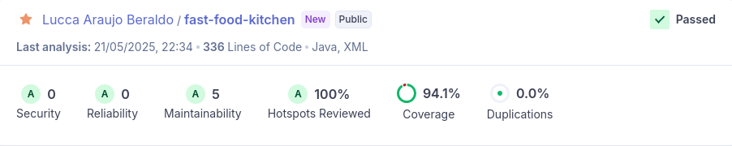

# Fast Food Kitchen

O projeto gerencia o fluxo da cozinha de uma lanchonete.

## Sumário

- [Descrição](#descrição)
- [Instalação](#instalação)
- [Uso](#uso)
- [Endpoints de Testes](#endpoints-de-testes)
- [Autores e Reconhecimentos](#autores-e-reconhecimentos)
- [Evidência da cobertura](#evidencia-da-cobertura)

## Descrição

O projeto tem por objetivo ajudar uma lanchonete em processo de expansão,
provendo um sistema de autoatendimento de fast-food.

O projeto consegue salvar um pedido e seu status.
Consegue também listar todos os pedidos finalizados.
O projeto tem um mock para atualizar o status a cada 5 minutos, simulando quando a cozinha finaliza 
um pedido.

## Instalação e Uso

Instruções para instalação do projeto.

```bash
# Clone o repositório
git clone https://github.com/beraldoLucca/fast-food-kitchen.git

# Navegue até o diretório do projeto
cd fast-food-kitchen

# Empacote o projeto, usando o comando abaixo, para que seja gerado a versão:
mvn package

# Execute o comando abaixo para rodar a aplicação:
docker-compose up --build

# Depois da aplicação estar rodando, acesse a URL do Swagger:
http://localhost:8082/api

# Para ver o documento de open-api, acesse a URL:
http://localhost:8082/api-docs
```

## Endpoints de Testes

### Introdução
Aqui estão os endpoints da API que você pode usar para testar as funcionalidades.


### Endpoints principais:

-   ### Cadastrar um novo pedido na cozinha
    - #### URL: /kitchen/demand
    - #### Método: `POST`
    - #### Cabeçalho:
    {"orderId": "1L",
    "products": [{ "name": "batata" }],
    "status": "EM_PREPARACAO""}
    - #### Resposta:
            Pedido recebido pela cozinha!

-   ### Buscar todos os pedidos finalizados
    - #### URL: /kitchen/demands
    - #### Método: `GET`
    - #### Resposta:
    [{"orderId": 1L,
    "products": [{ "name": "batata" }],
    "status": "FINALIZADO"]

## Evidência da cobertura



## Autores e Reconhecimentos

Lucca Beraldo

